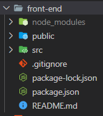
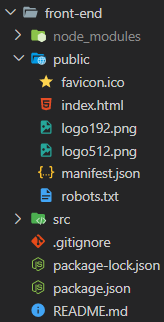
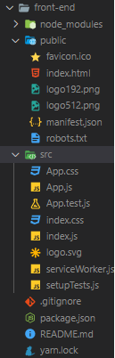
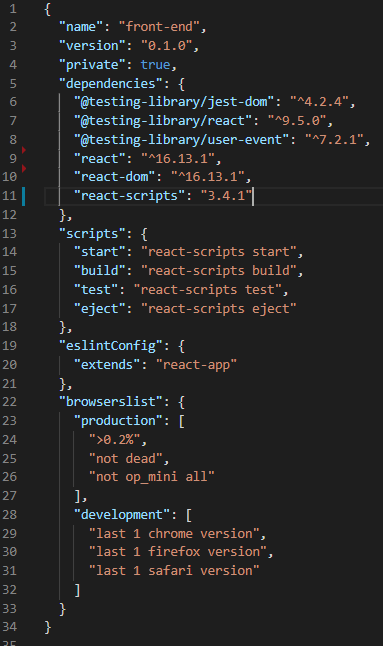

# React a create react app

# React

- je to javascriptová knižnica, ktorá umožnuje jednoducho vyskladať webove rozhranie pomocou component, ktoré vkladá do DOMu a pred vložením naskôr vysklada virtuálny DOM
- vramci používania react knižnice môžme používať jsx zápis
- jsx je zapis javascriptu spolus HTMLkom

## aplikacie

- single page aplication
  jedno HTMLko v ktorom sa pomocou napr. react. prekresluje component a nerefreshuje sa stranka a tiez sa znova nestahujú všetky zdrojové kody (cssko, js, html, bootstrap,...) pop prvom nacitani stranky.<br>
  je webová aplikácia alebo webová stránka, ktorá spolupracuje s webovým prehliadačom dynamickým prepisovaním aktuálnej webovej stránky novými údajmi z webového servera namiesto predvolenej metódy načítania celých nových stránok prehliadačom. Cieľom sú rýchlejšie prechody, vďaka ktorým bude web vyzerať skôr ako natívna aplikácia.
- multiple page aplication
  viacero HTML stranok, ktoré sa vykresľujú na servery.

pre rýchly šrart do reactu si naskôr vytovríme základ react aplikácie pomocou [create react app](https://reactjs.org/docs/create-a-new-react-app.html)

použitie: otvorim si vo vscode priečinok už s vyklonovaným repositárom z githubu alebo gitlabu. Následne si spustime terminál vo vscode a spustim príkaz

```
npx create-react-app my-app
```

premenna `my-app` ktorú píšem za príkazom `create-react-app` je názov novovytvorenej aplikácie, kedže budeme písať `front-end` aplikácie môžme to premenovať na tento názov viď príklad:

```
npx create-react-app front-end
```

po stiahnutí a vytvorení základu aplikácie s názvom front-end v tomto priečinku budem mať takýto obsah:<br>


- node_modules priecinok obsahuje nainstalovane zavislosti cudzich balickov ktore sme stihli vramci spusteneho skriptu `create-react-app`. Nachadzaju sa tam vsetky zavislosti aplikacie.
- public priecinok obsahuje staticku cast aplikacie ktora sa nacitava v prehliadaci.
  
- src priecinok obsahuje zakladne vygenerovane javascriptove, css, svg, subory ktore tvoria zaklad react aplikacie.
  
- .gitignore služi na defionvanie súborov a pričinkov ktoré maju byť ignorované pri komitovani zmien do repositára na githube alebo gitlabe,...
- package.json obsahuje konfiguraciu aplikacie runnery, ktore pri spusteni v terminaly vykonavaju ukony vramci aplikacie
- yarn.lock subor reprezentuje historiu nainstalovanych zavislosti v node_modules tento subor mozem na zaciatku zmazat ak chcem pouzivat na ovladanie prikazov npm namiesto yarn. Co je [npm](https://docs.npmjs.com/about-npm/) a [yarn](https://classic.yarnpkg.com/en/docs/install#windows-stable) su to package managers ktoré slúžia na manipuláciu z packages.<br>
  Instalacia pomocou package managera npm

```
npm i
```

alebo yarn

```
yarn
```

ak mam node_modules priecinok a v nom vsetky potrebne zavislosti nainstalovane mozem v ramci package.json sa pozriet na skripts, kde je definovane ako sa pusta aplikacia<br>
na zaciatok ak chcem spustit aplikaciu mozem pouzit prikaz:

```
npm run start
```

alebo pre yarn

```
yarn start
```

ak sme vsetko dokoncili pri tvorbe aplikacie a chceme dany vysledok nahodit na github alebo gilab ako verejne funkcnu aplikaciu pouzijeme prikaz:

```
npm run build
```

alebo pre yarn

```
yarn build
```

ak by sme chceli testovat aplikaciu pomocou jest a pisat unit testy pouzijeme prikaz:

```
npm run test
```

alebo pre yarn

```
yarn test
```

ak by sme chceli odomknut viacej konfiguracie pre nastavenie aplikacie je tu moznost pouzit prikaz:

```
npm run eject
```

alebo pre yarn

```
yarn eject
```

<br>

okrem scripts tam môžeme vidiet dependencies packages zavislosti na inch balickov.<br>

Vramci src priecinka mozem vidiet index.js hlavny subor, v ktorom sa nachadza zaciatok strukturi aplikacie:

```js
// importnem si schopnosti z reactu
import React from 'react'
// importnem ReactDOM objekt
import ReactDOM from 'react-dom'
import './index.css'
import App from './App'
// import všetkého z serviceWorker konfiguračneho súboru
import * as serviceWorker from './serviceWorker'

ReactDOM.render(
	// a to jsx t.j. html alebo react components ktoré chcem vykresliť konrkrétne <React.StrictMode> slúži na skoré odhalenie chýb vrámci vyvoja a použitia react
	<React.StrictMode>
		{/* <App /> je componenta ktora sa importuje so suboru ./front-end/src/App.js */}
		<App />
	</React.StrictMode>,
	// a druhá hodnota je selektor ktorím selektnem div element v súbore ktorí sa nachádza v ./front-end/public/index.html
	document.getElementById('root')
)

// If you want your app to work offline and load faster, you can change
// unregister() to register() below. Note this comes with some pitfalls.
// Learn more about service workers: https://bit.ly/CRA-PWA
serviceWorker.unregister()
```

vramci App.js suboru mozme mat definovanu bud class componets alebo functional componets kazdy jsx vyraz ktori vracia komponenta sa po builde zmeni na javascript vid tekto priklad

```js
// tymto spôsobom vložim funkcionalitu React a doplnok { Component } ktorí doplňa extendnutú class App komponentu o ďalšie schopnosti
import React, { Component } from 'react'

// nasledne po class sa definuje názov class komponenty ktorú pomocou extends doplňam o schopnosti z reactu
class App extends Component {
	// táto funkcia musí byť vždy definovaná v class komponente a služí na vysklreslenie html + js kódu do DOMU
	render() {
		// návratová hodnota je JSX zápis t.j. HTML + JASVASCRIPT
		return (
			// ak chceme pridať css classu tak v jsx zápise sa používa len className kedže už hore je definované slovo class pred App. Treba mať na pamäto že po zbildeni aplikacie je prepísany na javascript. náš JSX vždy môže mať jeden koreňový prvok jeden element ako celok.
			<div className="App">
				<h1>Nadpis</h1>
			</div>
		)
	}
}
export default App
```

JSX zapis po zbildeni aplikácie vyzerá takto

```js
// tymto spôsobom vložim funkcionalitu React a doplnok { Component } ktorí doplňa extendnutú class App komponentu o ďalšie schopnosti
import React, { Component } from 'react'
// tymto spôsobom viem priradiť css štýli
import './styles.css'
// nasledne po class sa definuje názov class komponenty ktorú pomocou extends doplňam o schopnosti z reactu
class App extends Component {
	// táto funkcia musí byť vždy definovaná v class komponente a služí na vysklreslenie html + js kódu do DOMU
	render() {
		//tento kod je rovnaky ako JSX zapis hore po zbehnuti build procesu. To je dôvod prečo definujem všade import React...
		return React.createElement(
			'div',
			{ className: 'App' },
			React.creteElement('h1', null, 'Nadpis')
		)
	}
}
```

Komponenty sú úžasné, pretože môžeme sústrediť náš kód na každý súbor, a tak ho spravovať oveľa lepšie, jednoduchšie a vieme takto zglobalizovať duplicitný kód.

Ak vytvoríme komponentu ktorú chcem použíť na viacerých miestach rovnakú napr. vytvorim si Person komponentu s textom ktorí použijem tri krat pod sebou a vytvorím tak tri rovnaké texty jednoduchým kopírovanim komponenty.

Priklad
Vytovrim si komponentu `<Person />` ktora bude vraciat p a text I'am a Person and I am x years old! a použijeme ich x krat pod sebou

```js
import React from 'react'
const Person = () => <p>I'am a Person and I am x years old!</p>
export default Person
```

pouzitie vytvorenej komponenty

```js
// tymto spôsobom vložim funkcionalitu React a doplnok { Component } ktorí doplňa extendnutú class App komponentu o ďalšie schopnosti
import React, { Component } from 'react'
// tymto spôsobom viem priradiť css štýli
import './styles.css'
// nasledne po class sa definuje názov class komponenty ktorú pomocou extends doplňam o schopnosti z reactu
class App extends Component {
	// táto funkcia musí byť vždy definovaná v class komponente a služí na vysklreslenie html + js kódu do DOMU
	render() {
		//tento kod je rovnaky ako JSX zapis hore po zbehnuti build procesu. To je dôvod prečo definujem všade import React...
		// tato komponenta <Person /> vytvori tri texty vďaka kompírovaniu
		return (
			<div className="App">
				<Person />
				<Person />
				<Person />
			</div>
		)
	}
}
```

Ak vytvoríme komponentu ktorá vracia nič len holé HTML a text nazívame statickou komponentou ktorá nič nemení len vracia HTML kod.<br>

Príklad komponenty s dynamickym obsahom, konkretne v tomto priklade sme x pismeno nahradili javascriptovym kódom Math.random() ktoré vracia číslo 0 a 1 s desatinnými hodnotami. a Math.floor() zaokruhly hodnotu.

```js
import React from 'react'
const Person = () => (
	<p>I'am a Janko and I am Math.floor(Math.random() * 30) years old!</p>
)
export default Person
```

ak by sme chceli spustit v texte javascript medzi textom vykonáme to takto:

```js
import React from 'react'
const Person = () => (
	<p>I'am a Janko and I am {Math.floor(Math.random() * 30)} years old!</p>
)
export default Person
```

Zrazu sa nam nahodne generuju tri cisla v komponente `<Person />`<br>

Keď už vieme ako vykresľovať a kopirovať koponenty aj s js v texte tak môžme skúsiť použiť vlastný atribut. Môžeme vidieť že na pridavnie classy sa používa className a to preto lebo slovo class je už vyhradené pre triedu. Pre Person ak by som chcel pridať atribut a preposlať si hodnotu nazov človeka cez name atribut a vek človeka cez atribut age do komponenty urobil by som to takto napr.

```js
import React, { Component } from 'react'
import Person from '../../components/Person'
class App extends Component {
	render() {
		return (
			<div className="App">
				<Person name="Janko" age="28" />
				<Person name="Duri" age="27" />
				<Person name="Vierka" age="20" />
			</div>
		)
	}
}
export default App
```

ako vstupnu hodnotu pre Person funkciu si vzdy davam slovo `props` a to preto lebo to je pravidlo môžem si to pomenovať ináč ale `props` je best practice. Pomocou `props` si preposielam hodnoty z atributov pri použiti kopomenty. V person komponente sme vytovorili HTML s textom a s dynamickým obsahom ktoré sme nastavili z vonku v mieste kde skutočne využívame naše koponenty.

```js
import React from 'react'
const Person = props => (
	<p>
		I'am a {props.name} and I am {props.age} years old!
	</p>
)
export default Person
```

okrem zasielania hodnôt cez atributy vieme preposielať aj väčší obsah do koponenty pomocou `children` a to tým spôsobom že obalim obsah použítou komponentou Person vid. priklad:

```js
import React, { Component } from 'react'
import Person from '../../components/Person'
class App extends Component {
	render() {
		return (
			<div className="App">
				<Person name="Janko" age="28" />
				<Person name="Duri" age="27">
					My hobies: <p>Traktorista</p>
				</Person>
				<Person name="Vierka" age="20" />
			</div>
		)
	}
}
export default App
```

medzi použitu kompoentu vieme preposlať viac ako len text, vieme preposlať aj HTML alebo ďalšiu komponentu.

```js
import React from 'react'

const Person = props => (
	<>
		<p>
			I'am a {props.name} and I am {props.age} years old!
		</p>
		<p>{props.children}</p>
	</>
)

export default Person
```

## Pochopenie a použitie react hodnoty state

naskor si vytvorim tlacidlo button nasledne definujem atribut `onClick` ktore nam vytvara posluchaca na event klik teda ak kliknem na tlacidlo button tak sa vykona to co je definovane vo vnútri objektu `{}` pre nás ma po kliknuti prepisat state persons na nove hodnoty vid priklad.<br>

pouzitie state stavu v jsx zapise sa vykonava pomocou klucoveho slova this a cez bodku mam dostupnú premenu `state` a nasledne vytahujem z objektu co chcem pouzit.<br>

pre ulozenie zmeny stavu v premenej `state` pouzijeme metodu z klucoveho slova `this` metodu `setState({...})` kde do vnutra objektu tejto metody definujem svoj prepis predosleho stavu.

```js
import React, { Component } from 'react'
import Person from '../../components/Person'

class App extends Component {
	// normalom svete by som zacal takto const something = someValue ale toto nefunguje
	somthing = 'some value'
	// namiesto tohto zapisu pouzivame best pratice a vytvorime si premenu s nazvom state
	state = {
		persons: [
			{ name: 'Janko', age: 28 },
			{ name: 'Duri', age: 27 },
			{ name: 'Vierka', age: 20 },
		],
		otherState: 'some other value',
	}

	switchNameHandler = () => {
		// prepis stavu na novy stav po zavolani metody
		this.setState({
			persons: [
				{ name: 'Hanka', age: 2 },
				{ name: 'Feri', age: 10 },
				{ name: 'Dusi', age: 5 },
			],
		})
	}

	render() {
		// v konzole vidim vsetko obsah state aj s hodnotou otherState
		console.log(this.state)

		return (
			<div className="App">
				<button onClick={this.switchNameHandler}>Switch name</button>
				<Person
					name={this.state.persons[0].name}
					age={this.state.persons[0].age}
				/>
				<Person
					name={this.state.persons[1].name}
					age={this.state.persons[1].age}>
					My hobies: Traktorista
				</Person>
				<Person
					name={this.state.persons[2].name}
					age={this.state.persons[2].age}
				/>
			</div>
		)
	}
}

export default App
```

Prevediem si class App komponetu do funkcionalnej komponenty a vyskusame dany postup ukladania a prepisovania stavu pomocou react hooks a konkretne metody `useState` namiesto `setState`.

```js
import React, { useState } from 'react'
import Person from '../../components/Person'

const App = () => {
	//
	const [state, setstate] = useState({
		persons: [
			{ name: 'Janko', age: 28 },
			{ name: 'Duri', age: 27 },
			{ name: 'Vierka', age: 20 },
		],
		otherState: 'some other value',
	})

	const switchNameHandler = () => {
		setstate({
			persons: [
				{ name: 'Hanka', age: 2 },
				{ name: 'Feri', age: 10 },
				{ name: 'Dusi', age: 5 },
			],
		})
	}

	// v konzole vidim vsetko obsah state ale po zmena teda prepise stavu uz nevidim stav otherState
	console.log(state)

	return (
		<div className="App">
			<button onClick={switchNameHandler}>Switch name</button>
			<Person name={state.persons[0].name} age={state.persons[0].age} />
			<Person name={state.persons[1].name} age={state.persons[1].age}>
				My hobies: Traktorista
			</Person>
			<Person name={state.persons[2].name} age={state.persons[2].age} />
		</div>
	)
}

export default App
```

Ak chceme vytvorit globalnu funkciu `switchNameHandler` ktora bude očakávať vstupnú hodnotu ktoru vlozi a prepíse na novu hodnotu v objekte Persons konrektne prvý prvok z pola v premenej name<br>

preposielanie hodnoty do globalnej funkcie `switchNameHandler` sa v starsom zapise pise pomocou metody `bind()`, ktora ocakava dve vstupne hodnoty. Prava hodnota je this ktora definuje spojenie medzi metodou `switchNameHandler` a hodnotou ktoru definujeme ako druhý parameter konretne v príklade `Lietadlo`<br>

V nasom priklade sa metoda `switchNameHandler` zavola len po kliknuti na button
a to pomocou `onClick` atributu ktori obsahuje `{this.switchNameHandler.bind(this, 'Lietadlo')}`

```js
import React, { Component } from 'react'
import Person from '../../components/Person'
class App extends Component {
	// normalom svete by som zacal takto const something = someValue ale toto nefunguje
	somthing = 'some value'
	// namiesto tohto zapisu pouzivame best pratice a vytvorime si premenu s nazvom state
	state = {
		persons: [
			{ name: 'Janko', age: 28 },
			{ name: 'Duri', age: 27 },
			{ name: 'Vierka', age: 20 },
		],
		otherState: 'some other value',
	}
	switchNameHandler = newName => {
		// prepis stavu na novy stav po zavolani metody
		this.setState({
			persons: [
				{ name: newName, age: 2 },
				{ name: 'Feri', age: 10 },
				{ name: 'Dusi', age: 5 },
			],
		})
	}
	render() {
		return (
			<div className="App">
				<button onClick={this.switchNameHandler.bind(this, 'Lietadlo')}>
					Switch name
				</button>
				<Person
					name={this.state.persons[0].name}
					age={this.state.persons[0].age}
				/>
				<Person
					name={this.state.persons[1].name}
					age={this.state.persons[1].age}>
					My hobies: Traktorista
				</Person>
				<Person
					name={this.state.persons[2].name}
					age={this.state.persons[2].age}
				/>
			</div>
		)
	}
}
export default App
```

ak by sme chceli vytvoriť prepis stavu po kliknuti na jeden Person vytvorili by sme to takto:
naskôr si prepošlem funkciu ktora dokaze zmenit stav t.j. `switchNameHandler` pomocou atributu s nazvom `click`

```js
import React, { Component } from 'react'
import Person from '../../components/Person'
class App extends Component {
	// normalom svete by som zacal takto const something = someValue ale toto nefunguje
	somthing = 'some value'
	// namiesto tohto zapisu pouzivame best pratice a vytvorime si premenu s nazvom state
	state = {
		persons: [
			{ name: 'Janko', age: 28 },
			{ name: 'Duri', age: 27 },
			{ name: 'Vierka', age: 20 },
		],
		otherState: 'some other value',
	}
	switchNameHandler = newName => {
		// prepis stavu na novy stav po zavolani metody
		this.setState({
			persons: [
				{ name: newName, age: 2 },
				{ name: 'Feri', age: 10 },
				{ name: 'Dusi', age: 5 },
			],
		})
	}
	render() {
		return (
			<div className="App">
				<button onClick={this.switchNameHandler.bind(this, 'Lietadlo')}>
					Switch name
				</button>
				<Person
					name={this.state.persons[0].name}
					age={this.state.persons[0].age}
				/>
				<Person
					name={this.state.persons[1].name}
					age={this.state.persons[1].age}
					click={this.switchNameHandler.bind(this, 'auto')}>
					My hobies: Traktorista
				</Person>
				<Person
					name={this.state.persons[2].name}
					age={this.state.persons[2].age}
				/>
			</div>
		)
	}
}
export default App
```

nasledne v componente Person musim definovat novú vstupnú premennu `click`

```js
import React from 'react'

const Person = ({ name, age, children, click }) => (
	<div onClick={click}>
		<p>
			I'am a {name} and I am {age} years old!
		</p>
		{children && <p>{children}</p>}
	</div>
)

export default Person
```

Novsi zapis prepojenia click eventu piseme takto:

```js
import React, { Component } from 'react'
import Person from '../../components/Person'
class App extends Component {
	// normalom svete by som zacal takto const something = someValue ale toto nefunguje
	somthing = 'some value'
	// namiesto tohto zapisu pouzivame best pratice a vytvorime si premenu s nazvom state
	state = {
		persons: [
			{ name: 'Janko', age: 28 },
			{ name: 'Duri', age: 27 },
			{ name: 'Vierka', age: 20 },
		],
		otherState: 'some other value',
	}
	switchNameHandler = newName => {
		// prepis stavu na novy stav po zavolani metody
		this.setState({
			persons: [
				{ name: newName, age: 2 },
				{ name: 'Feri', age: 10 },
				{ name: 'Dusi', age: 5 },
			],
		})
	}
	render() {
		return (
			<div className="App">
				<button onClick={() => this.switchNameHandler('Lietadlo')}>
					Switch name
				</button>
				<Person
					name={this.state.persons[0].name}
					age={this.state.persons[0].age}
				/>
				<Person
					name={this.state.persons[1].name}
					age={this.state.persons[1].age}
					click={() => this.switchNameHandler('auto')}>
					My hobies: Traktorista
				</Person>
				<Person
					name={this.state.persons[2].name}
					age={this.state.persons[2].age}
				/>
			</div>
		)
	}
}
export default App
```

Atributy pomocou ktorich vieme kontrolovať teda vytvárať poslucháčov na eventy:
[vaic info](https://reactjs.org/docs/events.html#form-events)

- vramci klavesici kontrola pisania

```
onKeyDown onKeyPress onKeyUp
```

- vramci pozicie mysi nad elementom a odchod kurzora mysi z elementu

```
onFocus onBlur
```

- vramci formularovych elementov pouzivame tieto atributy

```
onChange onInput onInvalid onReset onSubmit
```

- vramci mysi mame tieto atributy

```
onClick onDoubleClick onDrag onDragEnd onDragEnter onDragExit
onDragLeave onDragOver onDragStart onDrop onMouseDown onMouseEnter onMouseLeave
onMouseMove onMouseOut onMouseOver onMouseUp
```

- na kontrolu a zachytavanie eventu skroll

```
onScroll
```

## Pridanie obojsmernej väzby

priklad vytvorim si input v Person komponente s type atributom `text` pridame atirbut `onChange` kotri reprezentuje poslucháča ktorí sa spustí vždy, keď sa zmení value v tomto inpute. Pre `onChange` atribut definujem hodnotu z vonku t.j. hodnota bude definovana tam kde je dana komponenta použitá (v App.js subore) cez premennú `changed`

```js
import React from 'react'

const Person = ({ name, age, children, click, changed }) => (
	<div onClick={click}>
		<p>
			I'am a {name} and I am {age} years old!
		</p>
		{children && <p>{children}</p>}
		<input type="text" onChange={changed} />
	</div>
)

export default Person
```

následne idem vytvoriť funkcionalitu v `App.js` subore ktora bude preposielana cez premennu `changed`

```js
import React, { Component } from 'react'
import Person from '../../components/Person'

class App extends Component {
	// normalom svete by som zacal takto const something = someValue ale toto nefunguje
	somthing = 'some value'
	// namiesto tohto zapisu pouzivame best pratice a vytvorime si premenu s nazvom state
	state = {
		persons: [
			{ name: 'Janko', age: 28 },
			{ name: 'Duri', age: 27 },
			{ name: 'Vierka', age: 20 },
		],
		otherState: 'some other value',
	}

	switchNameHandler = newName => {
		// prepis stavu na novy stav po zavolani metody
		this.setState({
			persons: [
				{ name: 'Janko', age: 2 },
				{ name: newName, age: 10 },
				{ name: 'Dusi', age: 5 },
			],
		})
	}

	nameChnagedHandler = event => {
		this.setState({
			persons: [
				{ name: event.target.value, age: 2 },
				{ name: 'Feri', age: 10 },
				{ name: 'Dusi', age: 5 },
			],
		})
	}

	render() {
		return (
			<div className="App">
				<button onClick={() => this.switchNameHandler('Lietadlo')}>
					Switch name
				</button>
				<Person
					changed={this.nameChnagedHandler}
					name={this.state.persons[0].name}
					age={this.state.persons[0].age}
				/>
				<Person
					name={this.state.persons[1].name}
					age={this.state.persons[1].age}
					click={() => this.switchNameHandler('auto')}>
					My hobies: Traktorista
				</Person>
				<Person
					name={this.state.persons[2].name}
					age={this.state.persons[2].age}
				/>
			</div>
		)
	}
}

export default App
```

Ak by sme chceli vidiet na zaciatku nacitania stranky aktualnu hodnotu mena v inpute. Tu nastava obojsmerna vazba v komponente Person. Najskor definujem value atribut spresposlanou hodnotou name

```js
import React from 'react'

const Person = ({ name, age, children, click, changed }) => (
	<div onClick={click}>
		<p>
			I'am a {name} and I am {age} years old!
		</p>
		{children && <p>{children}</p>}
		<input type="text" onChange={changed} value={name} />
	</div>
)

export default Person
```

vsimnime si ze druhy a treti Person input nemoze menit value a to preto lebo nemaju definovanu onChange hodnotu ktora umoznuje prepis noveho stavu.

## Pridavanie styles

je kopec sposobov

- najskor prepojenim cez css subor priklad

vytvorim si v priesinku Person novy subor s nazvom `style.css`

```css
.wrapper {
	width: 200px;
	margin: 16px;
	border: 1px solid black;
	box-shadow: 0 2px 3px #ccc;
	padding: 15px;
	text-align: center;
}
```

nezabudnut si importnut subor css

```js
import React from 'react'
import './style.css'

const Person = ({ name, age, children, click, changed }) => (
	<div onClick={click} className="wrapper">
		<p>
			I'am a {name} and I am {age} years old!
		</p>
		{children && <p>{children}</p>}
		<input type="text" onChange={changed} value={name} />
	</div>
)

export default Person
```

nevyhoda je ze ak pouzijeme niekde v projekte rovnaku classu aka je v Person komponente t.j. `wrapper` tak ten element dostane rovanke cssko a moze sa lahko stat ze nam to niekto prepise vramci projektu.

- inline styles pomocou atributu `style={{}}`

```js
import React, { Component } from 'react'
import Person from '../../components/Person'

class App extends Component {
	// normalom svete by som zacal takto const something = someValue ale toto nefunguje
	somthing = 'some value'
	// namiesto tohto zapisu pouzivame best pratice a vytvorime si premenu s nazvom state
	state = {
		persons: [
			{ name: 'Janko', age: 28 },
			{ name: 'Duri', age: 27 },
			{ name: 'Vierka', age: 20 },
		],
		otherState: 'some other value',
	}

	switchNameHandler = newName => {
		// prepis stavu na novy stav po zavolani metody
		this.setState({
			persons: [
				{ name: 'Janko', age: 2 },
				{ name: newName, age: 10 },
				{ name: 'Dusi', age: 5 },
			],
		})
	}

	nameChnagedHandler = event => {
		this.setState({
			persons: [
				{ name: event.target.value, age: 2 },
				{ name: 'Feri', age: 10 },
				{ name: 'Dusi', age: 5 },
			],
		})
	}

	render() {
		const style = {
			backgroundColor: 'white',
			font: 'inherit',
			border: '1px solid blue',
			padding: '8px',
			cursor: 'pointer',
		}
		return (
			<div className="App">
				<button
					style={style}
					onClick={() => this.switchNameHandler('Lietadlo')}>
					Switch name
				</button>
				<Person
					changed={this.nameChnagedHandler}
					name={this.state.persons[0].name}
					age={this.state.persons[0].age}
				/>
				<Person
					name={this.state.persons[1].name}
					age={this.state.persons[1].age}
					click={() => this.switchNameHandler('auto')}>
					My hobies: Traktorista
				</Person>
				<Person
					name={this.state.persons[2].name}
					age={this.state.persons[2].age}
				/>
			</div>
		)
	}
}

export default App
```

inline styles ma prednost pred styles z css suboru
vyhoda cssko bude aplikovane len na elmente kde sme ho definovali

- lepsie riesenie je naucit sa pouzivat [styled-componentes](https://styled-components.com/)

## podmienkz vykreslenia dvoch komponent na základe klikania

[react dokumentacia s prikladami](https://reactjs.org/docs/conditional-rendering.html)

nainicializujeme pre state objekt novu hodnotu `showPersons` a nastvim ju na false to bude hodnota pomocou ktorej budeme ifovat obsah.
obalime si vsetky Person komponenty do jedneho div elementu a prepseme funkciu v buttone z `switchNameHandler` na `togglePersonsHandler` a definujem si tuto funkciu v classe ktora bude menit pomocou setState stav pre showPersons takto `this.setState({ showPersons: !this.state.showPersons })` nasledne si vytvorim podmienku pre nase div ktore obaluje Person. Vramci JSX sa pisu podmienkz vo vnutri pomocou ternanerho zapisu takto `podmienka ? priestor pre podmienku ktora je pravidva : priestor pre podmienku ktora je nepravdiva` v nasom pripade to bude `this.state.showPersons` nemusim hodnotu porovnavat s true ako `this.state.showPersons === true` pretoze nas parameter showPersons je boolean hodnota...

```js
import React, { Component } from 'react'
import Person from '../../components/Person'

class App extends Component {
	// normalom svete by som zacal takto const something = someValue ale toto nefunguje
	somthing = 'some value'
	// namiesto tohto zapisu pouzivame best pratice a vytvorime si premenu s nazvom state
	state = {
		persons: [
			{ name: 'Janko', age: 28 },
			{ name: 'Duri', age: 27 },
			{ name: 'Vierka', age: 20 },
		],
		otherState: 'some other value',
		showPersons: false,
	}

	switchNameHandler = newName => {
		// prepis stavu na novy stav po zavolani metody
		this.setState({
			persons: [
				{ name: 'Janko', age: 2 },
				{ name: newName, age: 10 },
				{ name: 'Dusi', age: 5 },
			],
		})
	}

	nameChnagedHandler = event => {
		this.setState({
			persons: [
				{ name: event.target.value, age: 2 },
				{ name: 'Feri', age: 10 },
				{ name: 'Dusi', age: 5 },
			],
		})
	}

	togglePersonsHandler = () => {
		this.setState({ showPersons: !this.state.showPersons })
	}

	render() {
		const style = {
			backgroundColor: 'white',
			font: 'inherit',
			border: '1px solid blue',
			padding: '8px',
			cursor: 'pointer',
		}

		return (
			<div className="App">
				<button style={style} onClick={this.togglePersonsHandler}>
					Switch name
				</button>
				{this.state.showPersons ? (
					<div>
						<Person
							changed={this.nameChnagedHandler}
							name={this.state.persons[0].name}
							age={this.state.persons[0].age}
						/>
						<Person
							name={this.state.persons[1].name}
							age={this.state.persons[1].age}
							click={() => this.switchNameHandler('auto')}>
							My hobies: Traktorista
						</Person>
						<Person
							name={this.state.persons[2].name}
							age={this.state.persons[2].age}
						/>
					</div>
				) : null}
			</div>
		)
	}
}

export default App
```

ak je podmienka false a nechcem vraciať nič môžem použiť kratši zapis pomocou `&&` takto

```js
import React, { Component } from 'react'
import Person from '../../components/Person'

class App extends Component {
	// normalom svete by som zacal takto const something = someValue ale toto nefunguje
	somthing = 'some value'
	// namiesto tohto zapisu pouzivame best pratice a vytvorime si premenu s nazvom state
	state = {
		persons: [
			{ name: 'Janko', age: 28 },
			{ name: 'Duri', age: 27 },
			{ name: 'Vierka', age: 20 },
		],
		otherState: 'some other value',
		showPersons: false,
	}

	switchNameHandler = newName => {
		// prepis stavu na novy stav po zavolani metody
		this.setState({
			persons: [
				{ name: 'Janko', age: 2 },
				{ name: newName, age: 10 },
				{ name: 'Dusi', age: 5 },
			],
		})
	}

	nameChnagedHandler = event => {
		this.setState({
			persons: [
				{ name: event.target.value, age: 2 },
				{ name: 'Feri', age: 10 },
				{ name: 'Dusi', age: 5 },
			],
		})
	}

	togglePersonsHandler = () => {
		this.setState({ showPersons: !this.state.showPersons })
	}

	render() {
		const style = {
			backgroundColor: 'white',
			font: 'inherit',
			border: '1px solid blue',
			padding: '8px',
			cursor: 'pointer',
		}

		return (
			<div className="App">
				<button style={style} onClick={this.togglePersonsHandler}>
					Switch name
				</button>
				{this.state.showPersons && (
					<div>
						<Person
							changed={this.nameChnagedHandler}
							name={this.state.persons[0].name}
							age={this.state.persons[0].age}
						/>
						<Person
							name={this.state.persons[1].name}
							age={this.state.persons[1].age}
							click={() => this.switchNameHandler('auto')}>
							My hobies: Traktorista
						</Person>
						<Person
							name={this.state.persons[2].name}
							age={this.state.persons[2].age}
						/>
					</div>
				)}
			</div>
		)
	}
}

export default App
```

dalsi sposob ako vieme narabat s dynamickym obsahom a ifovat ho je lepsi sposob kde oddelim logiku od vzkreslenej casti. Je to prefenovanejsi sposob a viacej citatelnejsi pre vacsie projekty.

```js
import React, { Component } from 'react'
import Person from '../../components/Person'

class App extends Component {
	// normalom svete by som zacal takto const something = someValue ale toto nefunguje
	somthing = 'some value'
	// namiesto tohto zapisu pouzivame best pratice a vytvorime si premenu s nazvom state
	state = {
		persons: [
			{ name: 'Janko', age: 28 },
			{ name: 'Duri', age: 27 },
			{ name: 'Vierka', age: 20 },
		],
		otherState: 'some other value',
		showPersons: false,
	}

	switchNameHandler = newName => {
		// prepis stavu na novy stav po zavolani metody
		this.setState({
			persons: [
				{ name: 'Janko', age: 2 },
				{ name: newName, age: 10 },
				{ name: 'Dusi', age: 5 },
			],
		})
	}

	nameChnagedHandler = event => {
		this.setState({
			persons: [
				{ name: event.target.value, age: 2 },
				{ name: 'Feri', age: 10 },
				{ name: 'Dusi', age: 5 },
			],
		})
	}

	togglePersonsHandler = () => {
		this.setState({ showPersons: !this.state.showPersons })
	}

	render() {
		const style = {
			backgroundColor: 'white',
			font: 'inherit',
			border: '1px solid blue',
			padding: '8px',
			cursor: 'pointer',
		}

		let persons = null
		if (this.state.showPersons) {
			persons = (
				<div>
					<Person
						changed={this.nameChnagedHandler}
						name={this.state.persons[0].name}
						age={this.state.persons[0].age}
					/>
					<Person
						name={this.state.persons[1].name}
						age={this.state.persons[1].age}
						click={() => this.switchNameHandler('auto')}>
						My hobies: Traktorista
					</Person>
					<Person
						name={this.state.persons[2].name}
						age={this.state.persons[2].age}
					/>
				</div>
			)
		}

		return (
			<div className="App">
				<button style={style} onClick={this.togglePersonsHandler}>
					Switch name
				</button>
				{persons}
			</div>
		)
	}
}

export default App
```

prepis do funkcionalne komponenty

```js
import React, { useState } from 'react'
import Person from '../../components/Person'

const App = () => {
	const [state, setState] = useState([
		{ name: 'Janko', age: 28 },
		{ name: 'Duri', age: 27 },
		{ name: 'Vierka', age: 20 },
	])
	const [showPersons, setShowPersons] = useState(false)

	const switchNameHandler = newName => {
		setState([
			{ name: 'Janko', age: 2 },
			{ name: newName, age: 10 },
			{ name: 'Dusi', age: 5 },
		])
	}

	const nameChnagedHandler = event => {
		setState([
			{ name: event.target.value, age: 2 },
			{ name: 'Feri', age: 10 },
			{ name: 'Dusi', age: 5 },
		])
	}

	const togglePersonsHandler = () => {
		setShowPersons(!showPersons)
	}

	const style = {
		backgroundColor: 'white',
		font: 'inherit',
		border: '1px solid blue',
		padding: '8px',
		cursor: 'pointer',
	}

	let persons = null
	if (showPersons) {
		persons = (
			<div>
				<Person
					changed={nameChnagedHandler}
					name={state[0].name}
					age={state[0].age}
				/>
				<Person
					name={state[1].name}
					age={state[1].age}
					click={() => switchNameHandler('auto')}>
					My hobies: Traktorista
				</Person>
				<Person name={state[2].name} age={state[2].age} />
			</div>
		)
	}

	return (
		<div className="App">
			<button style={style} onClick={togglePersonsHandler}>
				Switch name
			</button>
			{persons}
		</div>
	)
}

export default App
```

## Vystupné zoznamy

t.j. vieme opakujucu Person komponentu vzkreslit pomocou map metody a prejst vsetkymi prvkami v poli nemusime deklarovat toľko krát pod sebou komponentu Person. Dokážeme vykresliť toľko Person výstupov koľko mame prvkov v poli...

vramci map metodz vždy musim definovať atribut `key` ktori ocakva hodnotu string a musi to bzt nieco unikatne vacsinou su tieto id definovane z databazy. Slúži to reactu na to aby vedel rýchlejšie vykresľovať elementy vramci map a renderovať komponentu len so zmeneným stavom.

```js
import React, { Component } from 'react'
import Person from '../../components/Person'

class App extends Component {
	// normalom svete by som zacal takto const something = someValue ale toto nefunguje
	somthing = 'some value'
	// namiesto tohto zapisu pouzivame best pratice a vytvorime si premenu s nazvom state
	state = {
		persons: [
			{ id: 'asdfa1', name: 'Janko', age: 28 },
			{ id: 'asdfa2', name: 'Duri', age: 27 },
			{ id: 'asdfa3', name: 'Vierka', age: 20 },
		],
		showPersons: false,
	}

	deletePersonHanlder = personIndex => {
		// objekty a polia v js su referencenho typu, cize sa nesmu priamo mutovat teda menit prepisovat doplnat ich obsah
		// vramci nacitania dat presons aby sme nemutovali stare pole a nieco nepokazili tak vytvarame nove pole a cez spred operator tj. `...` vztiahnem obsah pola
		// starsi sposob
		// const persons = this.state.persons.slice()
		// novsi sposob
		const persons = [...this.state.persons]

		persons.splice(personIndex, 1)
		this.setState({ persons: persons })
	}

	nameChnagedHandler = (event, personId) => {
		// naskor potrebujem zistit v ktorom inpute robim zmenu
		// pomocou findIndex najdem objekt v ktorom robim zmenu a vratim jeho poziciu
		const personIndex = this.state.persons.findIndex(personItem => {
			return personItem.id === personId
		})

		// naskor aby som nemutoval exitujuci objekt vytvorim si novy
		// do tohto objektu vkladam obsah person len ten ktori chcem zmenit
		// pomocou spred operatora vytiahnem vsetky hodnoty vramci vytiahnuteho objektu z pola
		const person = {
			...this.state.persons[personIndex],
		}
		// prepisem name na novu hodnotu zo zachyteneho eventu ktori uchovava aktualnu value z inputu
		person.name = event.target.value

		// vytvorim si nove pole ktore chcem mutovat
		const persons = [...this.state.persons]
		// najdem si v tom novom poli objekt ktori chcem prepisat na novy objekt z novou name
		persons[personIndex] = person

		// prepisem stav stary persons na novy presons
		this.setState({ persons: persons })
	}

	togglePersonsHandler = () => {
		this.setState({ showPersons: !this.state.showPersons })
	}

	render() {
		const style = {
			backgroundColor: 'white',
			font: 'inherit',
			border: '1px solid blue',
			padding: '8px',
			cursor: 'pointer',
		}

		let persons = null
		if (this.state.showPersons) {
			persons = (
				<div>
					{this.state.persons.map((person, index) => (
						<Person
							changed={event => this.nameChnagedHandler(event, person.id)}
							click={() => this.deletePersonHanlder(index)}
							key={person.id}
							name={person.name}
							age={person.age}
						/>
					))}
				</div>
			)
		}

		return (
			<div className="App">
				<button style={style} onClick={this.togglePersonsHandler}>
					Switch name
				</button>
				{persons}
			</div>
		)
	}
}

export default App
```

prepis na funkcionalnu komponentu

```js
import React, { useState } from 'react'
import Person from '../../components/Person'

const App = () => {
	const [persons, setPersons] = useState([
		{ id: 'asdfa1', name: 'Janko', age: 28 },
		{ id: 'asdfa2', name: 'Duri', age: 27 },
		{ id: 'asdfa3', name: 'Vierka', age: 20 },
	])
	const [showPersons, setShowPersons] = useState(false)

	const deletePersonHanlder = personIndex => {
		const newPersons = [...persons]
		newPersons.splice(personIndex, 1)
		setPersons(newPersons)
	}

	const nameChnagedHandler = (event, personId) => {
		const personIndex = persons.findIndex(personItem => {
			return personItem.id === personId
		})
		const person = {
			...persons[personIndex],
		}
		person.name = event.target.value

		const newPersons = [...persons]
		newPersons[personIndex] = person
		setPersons(newPersons)
	}
	const togglePersonsHandler = () => {
		setShowPersons(!showPersons)
	}
	const style = {
		backgroundColor: 'white',
		font: 'inherit',
		border: '1px solid blue',
		padding: '8px',
		cursor: 'pointer',
	}

	let personsElement = null
	if (showPersons) {
		personsElement = (
			<div>
				{persons.map((person, index) => (
					<Person
						changed={event => nameChnagedHandler(event, person.id)}
						click={() => deletePersonHanlder(index)}
						key={person.id}
						name={person.name}
						age={person.age}
					/>
				))}
			</div>
		)
	}

	return (
		<div className="App">
			<button style={style} onClick={togglePersonsHandler}>
				Switch name
			</button>
			{personsElement}
		</div>
	)
}

export default App
```

## Dynamické nastavovanie štýlov

zmenme farbu pozadia pre tlacidlo na zelenu a farba pisma na bielu. Skúsme po kliknuti na tlacidlo nech sa farba pozadia meni zo zelenej na cervenu a naopak...

```jsx
import React, { Component } from 'react'
import Person from '../../components/Person'

class App extends Component {
	state = {
		persons: [
			{ id: 'asdfa1', name: 'Janko', age: 28 },
			{ id: 'asdfa2', name: 'Duri', age: 27 },
			{ id: 'asdfa3', name: 'Vierka', age: 20 },
		],
		showPersons: false,
	}

	deletePersonHanlder = personIndex => {
		const persons = [...this.state.persons]

		persons.splice(personIndex, 1)
		this.setState({ persons: persons })
	}

	nameChnagedHandler = (event, personId) => {
		const personIndex = this.state.persons.findIndex(personItem => {
			return personItem.id === personId
		})

		const person = {
			...this.state.persons[personIndex],
		}
		person.name = event.target.value

		const persons = [...this.state.persons]
		persons[personIndex] = person

		this.setState({ persons: persons })
	}

	togglePersonsHandler = () => {
		this.setState({ showPersons: !this.state.showPersons })
	}

	render() {
		const style = {
			backgroundColor: 'green',
			color: 'white',
			font: 'inherit',
			border: '1px solid blue',
			padding: '8px',
			cursor: 'pointer',
		}

		let persons = null
		if (this.state.showPersons) {
			persons = (
				<div>
					{this.state.persons.map((person, index) => (
						<Person
							changed={event => this.nameChnagedHandler(event, person.id)}
							click={() => this.deletePersonHanlder(index)}
							key={person.id}
							name={person.name}
							age={person.age}
						/>
					))}
				</div>
			)
			// prepis inline style z green na red
			style.backgroundColor = 'red'
		}

		return (
			<div className="App">
				<button style={style} onClick={this.togglePersonsHandler}>
					Switch name
				</button>
				{persons}
			</div>
		)
	}
}

export default App
```

Vytvorme si dve classy `.red` ktora bude obsahovat `color: red` a `.bold` bude pridavat `font-weight: bold` style.
Nad button Switch name si pridam p element s textom `Example text` a sk[sim pridat dve classy pre tento element

skusme pridat logiku ak je dlzka persons pola mensia rovna ako 2 tak pridam classu `.red` a dalsia logika ak je dlzka pola persons mensia a rovna 1 pridam classu `.bold`

```jsx
import React, { Component } from 'react'
import Person from '../../components/Person'
import './style.css'

class App extends Component {
	state = {
		persons: [
			{ id: 'asdfa1', name: 'Janko', age: 28 },
			{ id: 'asdfa2', name: 'Duri', age: 27 },
			{ id: 'asdfa3', name: 'Vierka', age: 20 },
		],
		showPersons: false,
	}

	deletePersonHanlder = personIndex => {
		const persons = [...this.state.persons]

		persons.splice(personIndex, 1)
		this.setState({ persons: persons })
	}

	nameChnagedHandler = (event, personId) => {
		const personIndex = this.state.persons.findIndex(personItem => {
			return personItem.id === personId
		})

		const person = {
			...this.state.persons[personIndex],
		}
		person.name = event.target.value

		const persons = [...this.state.persons]
		persons[personIndex] = person

		this.setState({ persons: persons })
	}

	togglePersonsHandler = () => {
		this.setState({ showPersons: !this.state.showPersons })
	}

	render() {
		const style = {
			backgroundColor: 'green',
			color: 'white',
			font: 'inherit',
			border: '1px solid blue',
			padding: '8px',
			cursor: 'pointer',
		}

		let persons = null
		if (this.state.showPersons) {
			persons = (
				<div>
					{this.state.persons.map((person, index) => (
						<Person
							changed={event => this.nameChnagedHandler(event, person.id)}
							click={() => this.deletePersonHanlder(index)}
							key={person.id}
							name={person.name}
							age={person.age}
						/>
					))}
				</div>
			)

			style.backgroundColor = 'red'
		}

		// zmena stylov pomocou class zo suboru style.css
		const classes = []
		if (this.state.persons.length <= 2) {
			classes.push('red')
		}
		if (this.state.persons.length <= 1) {
			classes.push('bold')
		}

		return (
			<div className="App">
				<p className={classes.join(' ')}>Example text</p>
				<button style={style} onClick={this.togglePersonsHandler}>
					Switch name
				</button>
				{persons}
			</div>
		)
	}
}

export default App
```

## Radium a pouzitie pseudo selektorov

vramci css vieme pridat psuedo selector napr. hover velmi jednoducho ale co ak sme chceli tuto moznost vykonat v inline styloch vramci reactu to nie je mozne ale je to mozne s pouzitim balicka [radium](https://www.npmjs.com/package/radium). Balíček je doplnok ktori už niekto vytvoril a ktori nám pridáva nejakú novú schopnosť. V našom prípad vieme pridavať pseudoselektori v inline style objekte. Inštalacia balíčka sa vykoná pomocou prikazu

```
npm install --save radium
```

alebo

```
yarn add radium
```

použitie tohto balíčka začína importom Radium

```jsx
import React, { Component } from 'react'
import Person from '../../components/Person'
// import balicka Radium a nasledne celkom na spodnej casti suboru prevolam metodu Radium do ktoreho vkladam class komponentu.
import Radium from 'radium'
import './style.css'

class App extends Component {
	state = {
		persons: [
			{ id: 'asdfa1', name: 'Janko', age: 28 },
			{ id: 'asdfa2', name: 'Duri', age: 27 },
			{ id: 'asdfa3', name: 'Vierka', age: 20 },
		],
		showPersons: false,
	}

	deletePersonHanlder = personIndex => {
		const persons = [...this.state.persons]

		persons.splice(personIndex, 1)
		this.setState({ persons: persons })
	}

	nameChnagedHandler = (event, personId) => {
		const personIndex = this.state.persons.findIndex(personItem => {
			return personItem.id === personId
		})

		const person = {
			...this.state.persons[personIndex],
		}
		person.name = event.target.value

		const persons = [...this.state.persons]
		persons[personIndex] = person

		this.setState({ persons: persons })
	}

	togglePersonsHandler = () => {
		this.setState({ showPersons: !this.state.showPersons })
	}

	render() {
		const style = {
			backgroundColor: 'green',
			color: 'white',
			font: 'inherit',
			border: '1px solid blue',
			padding: '8px',
			cursor: 'pointer',
			// teraz uz vieme vramci inline stylov pouzivat hover effecty
			':hover': {
				backgroundColor: 'lightgreen',
				color: 'black',
			},
		}

		let persons = null
		if (this.state.showPersons) {
			persons = (
				<div>
					{this.state.persons.map((person, index) => (
						<Person
							changed={event => this.nameChnagedHandler(event, person.id)}
							click={() => this.deletePersonHanlder(index)}
							key={person.id}
							name={person.name}
							age={person.age}
						/>
					))}
				</div>
			)

			style.backgroundColor = 'red'
			// ak chceme prepisat stylz pre pseudo selektor vieme to takto jednoducho
			style[':hover'] = {
				backgroundColor: 'salmon',
			}
		}

		const classes = []

		if (this.state.persons.length <= 2) {
			classes.push('red')
		}
		if (this.state.persons.length <= 1) {
			classes.push('bold')
		}

		return (
			<div className="App">
				<p className={classes.join(' ')}>Example text</p>
				<button style={style} onClick={this.togglePersonsHandler}>
					Switch name
				</button>
				{persons}
			</div>
		)
	}
}

// tym ze prevolam jednu funkcionalnu komponentu druhou a doplnim ju o schopnosti, Raddium sa stava higher order component (HOC). Nesk;r si HOC skusime vztovri aj my... Da sa to pouzit aj na class aj na func. komponenty rovnakym spôsobom.
export default Radium(App)
```

## Radium a použitie media query pre responzivitu

ak by sme cheli napisat v cssku media querz pre Person a zmenit sirku urobime to takto

```css
@media (min-width: 500px) {
	.wrapper {
		width: 450px;
	}
}
```

ak by sme to chceli urobit v inline zapise v Person funkcionalnej komponente urobime to takto

```jsx
import React from 'react'
import Radium from 'radium'
import './style.css'

const Person = ({ name, age, children, click, changed }) => {
	const style = {
		'@media(min-width: 500px)': {
			width: '450px',
		},
	}

	return (
		<div className="wrapper" style={style}>
			<p onClick={click}>remove person</p>
			<p>
				I'am a {name} and I am {age} years old!
			</p>
			{children && <p>{children}</p>}
			<input type="text" onChange={changed} value={name} />
		</div>
	)
}

export default Radium(Person)
```

ak by sme sa pozreli do prehliadaca a klikli na nas button uvideli sme error ktori nam hovori ze ak pouzivam media query alebo keyfrmes musim obalit danu funkcionalnu komponentu HOC komponentou `StyleRoot` takto

```jsx
import React, { Component } from 'react'
import Person from '../../components/Person'
import Radium, { StyleRoot } from 'radium'
import './style.css'

class App extends Component {
	state = {
		persons: [
			{ id: 'asdfa1', name: 'Janko', age: 28 },
			{ id: 'asdfa2', name: 'Duri', age: 27 },
			{ id: 'asdfa3', name: 'Vierka', age: 20 },
		],
		showPersons: false,
	}

	deletePersonHanlder = personIndex => {
		const persons = [...this.state.persons]

		persons.splice(personIndex, 1)
		this.setState({ persons: persons })
	}

	nameChnagedHandler = (event, personId) => {
		const personIndex = this.state.persons.findIndex(personItem => {
			return personItem.id === personId
		})

		const person = {
			...this.state.persons[personIndex],
		}
		person.name = event.target.value

		const persons = [...this.state.persons]
		persons[personIndex] = person

		this.setState({ persons: persons })
	}

	togglePersonsHandler = () => {
		this.setState({ showPersons: !this.state.showPersons })
	}

	render() {
		const style = {
			backgroundColor: 'green',
			color: 'white',
			font: 'inherit',
			border: '1px solid blue',
			padding: '8px',
			cursor: 'pointer',
			// teraz uz vieme vramci inline stylov pouzivat hover effecty
			':hover': {
				backgroundColor: 'lightgreen',
				color: 'black',
			},
		}

		let persons = null
		if (this.state.showPersons) {
			persons = (
				<div>
					{this.state.persons.map((person, index) => (
						<Person
							changed={event => this.nameChnagedHandler(event, person.id)}
							click={() => this.deletePersonHanlder(index)}
							key={person.id}
							name={person.name}
							age={person.age}
						/>
					))}
				</div>
			)

			style.backgroundColor = 'red'
			// ak chceme prepisat stylz pre pseudo selektor vieme to takto jednoducho
			style[':hover'] = {
				backgroundColor: 'salmon',
			}
		}

		const classes = []

		if (this.state.persons.length <= 2) {
			classes.push('red')
		}
		if (this.state.persons.length <= 1) {
			classes.push('bold')
		}

		return (
			<StyleRoot>
				<div className="App">
					<p className={classes.join(' ')}>Example text</p>
					<button style={style} onClick={this.togglePersonsHandler}>
						Switch name
					</button>
					{persons}
				</div>
			</StyleRoot>
		)
	}
}

export default Radium(App)
```

## intro styled components

styled-components je baliček ktori nám prídá kopec schopností pre naše react aplikácie.

- automatic critical css je schopnost kde styled component sleduje ktora komponenta sa vykresluje na stranke a automaticky vklada jej styly v najmensom potrebnom mnozstve alebo formate.
- ziadne className a menej chyb, znamena to ze kazdý pridaný štýl sa pridáva pomocou vygenerovanej unikatnej classy. Nikdy sa nestane to ze budem mat duplicitu a prepisanie si stylov medzi komponentami.
- lahsie mazanie a detekcia csska ktora je pouzita pre ktoru komponentu
- lahsia tvorba dynamickeho csska t.j. globalne styly sa daju jednoducho definovat z jedneho suboru a pouzivat nad vsetkymi styled komponentami
- lahsia udrzba kodu kedze stylujeme len v js suboroch
- automaticky prefix pre vsetky prehliadace.

ak chcem naisntalovat [styled-components](https://styled-components.com/)

```
npm install --save styled-components
```

alebo

```
yarn add --save styled-components
```

Pouzitie vramci funkcionalen komponentz v Person.js<br>

```jsx
import React from 'react'
import styled from 'styled-components'

const Wrapper = styled.div`
	width: 200px;
	margin: 16px;
	border: 1px solid black;
	box-shadow: 0 2px 3px #ccc;
	padding: 15px;
	text-align: center;

	@media (min-width: 500px) {
		.wrapper {
			width: 450px;
		}
	}
`

const Person = ({ name, age, children, click, changed }) => {
	return (
		<Wrapper>
			<p onClick={click}>remove person</p>
			<p>
				I'am a {name} and I am {age} years old!
			</p>
			{children && <p>{children}</p>}
			<input type="text" onChange={changed} value={name} />
		</Wrapper>
	)
}

export default Person
```

prepis class komponenty so styled components v tejto komponente mame aj dynamicke css ktore sa meni na zaklade nejakej podmienky to vieme v styled komponent vytvorit takto

```jsx
import React, { Component } from 'react'
import Person from '../../components/Person'
import styled from 'styled-components'

const Wrapper = styled.div`
	text-align: center;
`

const Text = styled.p`
	color: ${({ persons }) => persons.length <= 2 && 'red'};
	font-weight: ${({ persons }) => persons.length <= 1 && 'bold'};
`

const Button = styled.button`
	background-color: ${({ showPersons }) => (showPersons ? 'red' : 'green')};
	color: white;
	font: inherit;
	border: 1px solid blue;
	padding: 8px;
	cursor: pointer;

	&:hover {
		background-color: ${({ showPersons }) =>
			showPersons ? 'salmon' : 'lightgreen'};
		color: black;
	}
`

class App extends Component {
	state = {
		persons: [
			{ id: 'asdfa1', name: 'Janko', age: 28 },
			{ id: 'asdfa2', name: 'Duri', age: 27 },
			{ id: 'asdfa3', name: 'Vierka', age: 20 },
		],
		showPersons: false,
	}

	deletePersonHanlder = personIndex => {
		const persons = [...this.state.persons]

		persons.splice(personIndex, 1)
		this.setState({ persons: persons })
	}

	nameChnagedHandler = (event, personId) => {
		const personIndex = this.state.persons.findIndex(personItem => {
			return personItem.id === personId
		})

		const person = {
			...this.state.persons[personIndex],
		}
		person.name = event.target.value

		const persons = [...this.state.persons]
		persons[personIndex] = person

		this.setState({ persons: persons })
	}

	togglePersonsHandler = () => {
		this.setState({ showPersons: !this.state.showPersons })
	}

	render() {
		let persons = null
		if (this.state.showPersons) {
			persons = (
				<div>
					{this.state.persons.map((person, index) => (
						<Person
							changed={event => this.nameChnagedHandler(event, person.id)}
							click={() => this.deletePersonHanlder(index)}
							key={person.id}
							name={person.name}
							age={person.age}
						/>
					))}
				</div>
			)
		}

		return (
			<Wrapper>
				<Text persons={this.state.persons}>Example text</Text>
				<Button
					onClick={this.togglePersonsHandler}
					showPersons={this.state.showPersons}>
					Switch name
				</Button>
				{persons}
			</Wrapper>
		)
	}
}

export default App
```
